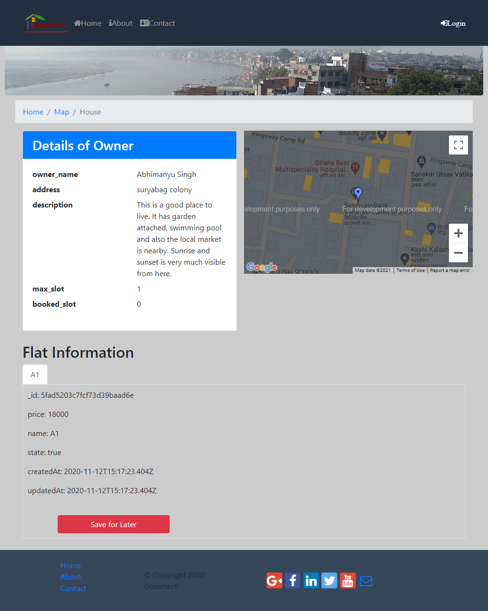

# Rental System for Varanasi Residence
<p>This rental system provides rent information 
for Varanasi city, Uttar Pradesh, India. This system tries to
serve the role of the third party broker in between the owner and
the tenant. Systems main aim is to provide its user the 
information obout the available house rents in the city.
Through this system any user can directly contact for rent
to it owner without wasting any further time and money in 
the broker.
</p>
<br>
<h3>Requirements covered are as follows:</h3>
<ul>
<li>User can see to the list of house for rent in the city.</li>
<li>User can see to the house related information.</li>
<li>A house may contain multiple rents.</li>
<li>Customer can save any rent for the later reference.</li>
<li>Guest can signup.</li>
<li>Customer can login and logout.</li>
<li>Customer can see to its saved rent in its saved log.</li>
<li>System can update any house or rent information.</li>
<li>System can block any user, in case of any misconduct.</li>
</ul>

<p><i>Here, <b>User</b> is the superset for <b>Guest</b> and
 <b>Customer.</b></i></p>
 <p><i><b>Customer</b> is one who is having an account on this system
  and <b>Guest</b> is the one who don't have any account.</i></p>
<br>

<h4>Accomplished work</h4>
<ul></ul>
<li>To fulfill the above requirement we have developed a fully 
functional, regular, real-time, responsive website for
rent booking in Varanasi. </li>
<li>Used the Google Map API to get the 
area wise rent search.</li>
<li>Technology used for backend: NodeJs, Mongodb.</li>
<li>Technology used for frontend: HTML, CSS, Bootstrap,
Javascript.</li>
<br>

<h3>How to run this project</h3>
<ul>
<li>Install node and npm.</li>
<li>Clone this repository to the local.</li>
<li>Install mongodb and run it in background.</li>
<li>Move to the clone repository in the terminal and
run the command <i><b>npm install</b></i>.</li>
<li>Run the command <i><b>npm start</b></i>. Now our system server will start
running in <i><b>localhost:5000</b></i></li>
<li>Now post some rent information from the local using the
<i><b>localhost:5000/admin/rents</b></i> api. You can use postman for the same.</li>
A sample post request that you can use can be:

```

{
    "latitude": 25.31,
    "longitude": 82.9,
    "owner_name": "rohit singh",
    "address": "xyz colony",
    "description": "this is a better",
    "max_slot": 2,
    "flat": [
        {
            "price": 8000,
            "name": "A1",
            "state": 0
        },
        {
            "price": 4000,
            "name": "A2",
            "state": 0
        }
    ]
}

```

<li>But before posting rents you need to authenticate 
by first signing up and then sending login post request to
<i><b>localhost:5000/auth/login</b></i></li>
</ul>

Screenshots for the system are as follows:

### Web UI

<div>


</div>
<div>



</div>
<div>


</div>
<div>

</div>


Happy coding!!